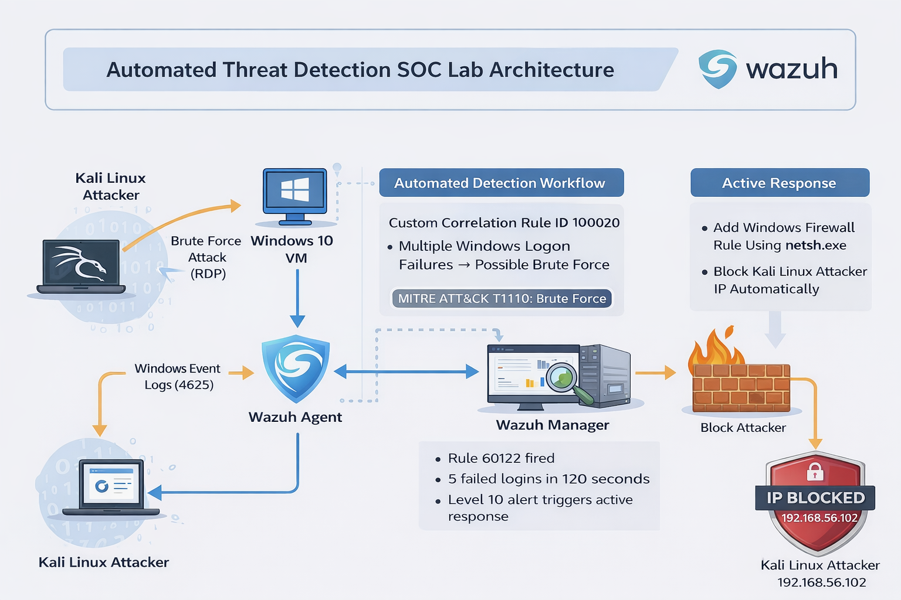

# Automated Threat Detection & Active Response SOC Lab (Wazuh SIEM)

## 📌 Project Overview

This project demonstrates an end-to-end SOC detection and automated response workflow using Wazuh SIEM.

The lab simulates a brute-force RDP attack from Kali Linux targeting a Windows 10 virtual machine. Wazuh detects repeated failed login attempts (Event ID 4625), correlates them using a custom aggregation rule, and automatically blocks the attacker IP using Windows Firewall via Active Response.

---

## 🏗️ Architecture

Workflow:

Kali Linux (Attacker)  
→ Windows 10 VM (Victim)  
→ Windows Event Logs (4625)  
→ Wazuh Agent  
→ Wazuh Manager  
→ Custom Rule 100020  
→ Active Response (netsh.exe)  
→ Firewall blocks attacker IP  

---

## 🔎 Detection Logic

### Default Rule Triggered
- Rule ID: 60122
- Event ID: 4625
- Description: Logon failure - Unknown user or bad password
- Level: 5

### Custom Aggregation Rule
- Rule ID: 100020
- Frequency: 5 failed logins
- Timeframe: 120 seconds
- Level: 10
- MITRE ATT&CK: T1110 (Brute Force)

If 5 failed logins occur within 120 seconds → Level 10 alert triggered.

---

## 🔐 Active Response

When rule 100020 fires:

Wazuh executes:

netsh.exe

Which creates a Windows Firewall rule to block the attacker's IP automatically.

---

## 🧪 Attack Simulation

Simulated using:
